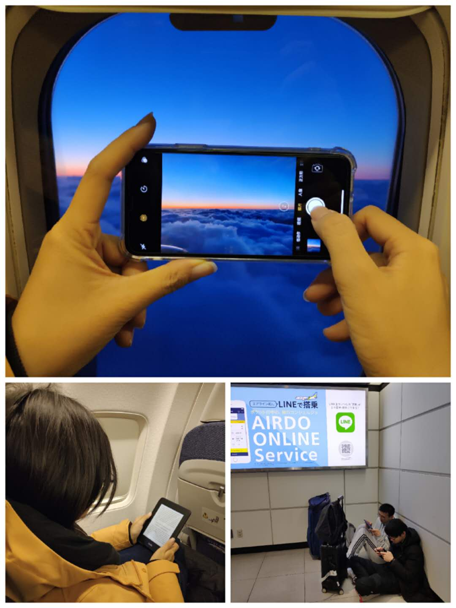
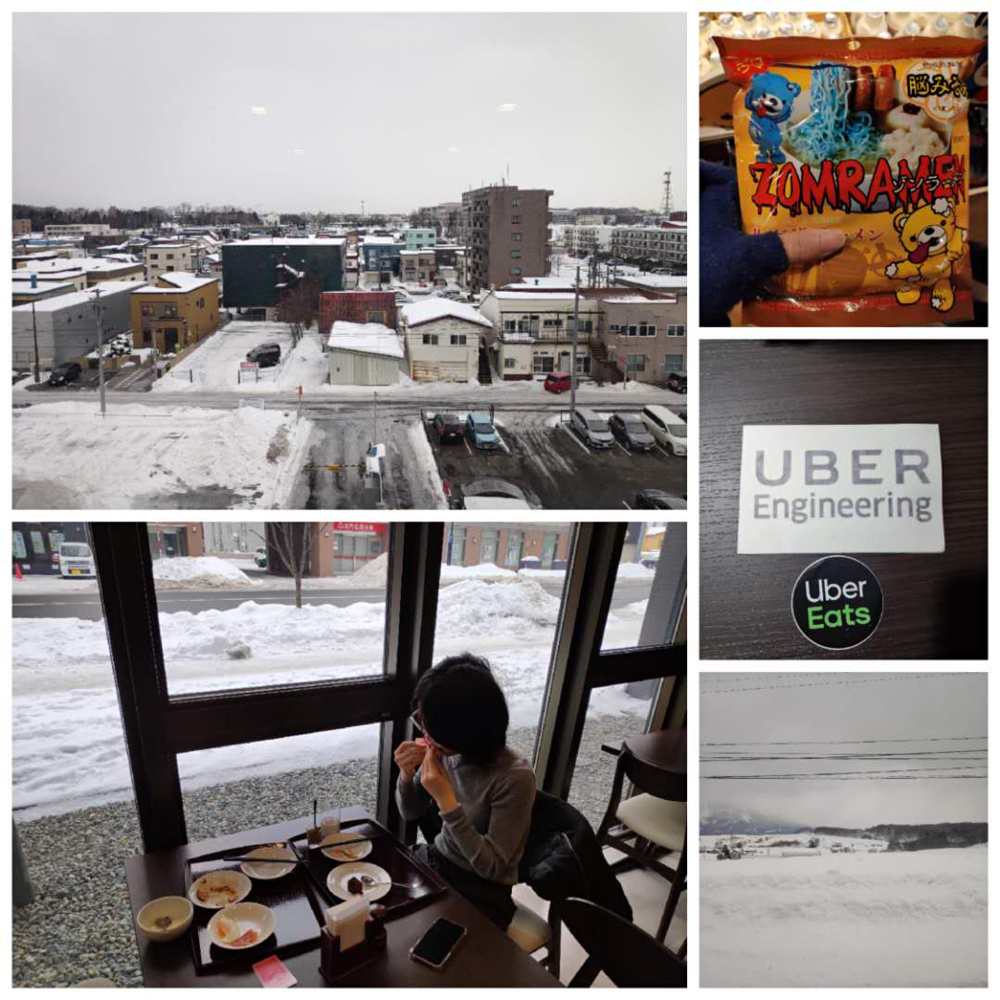
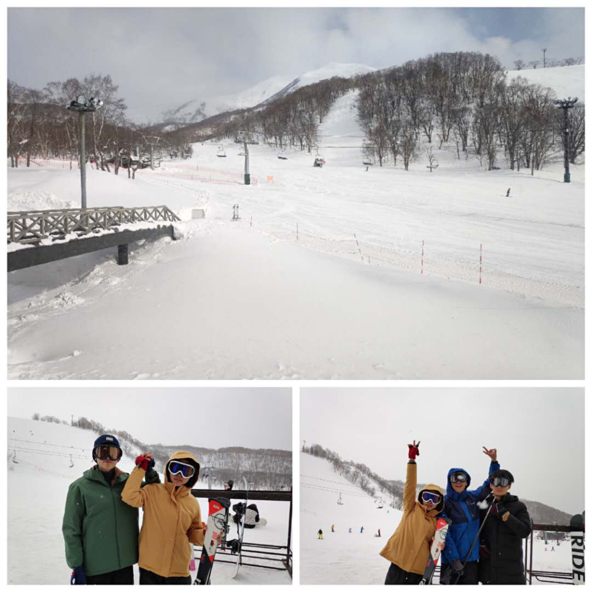
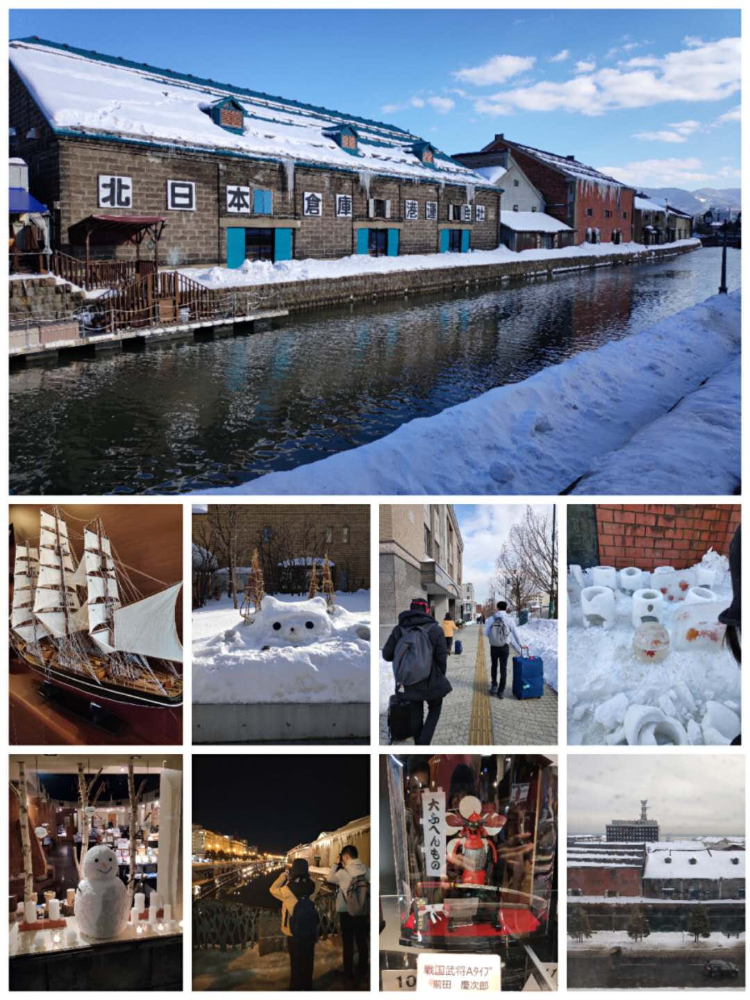
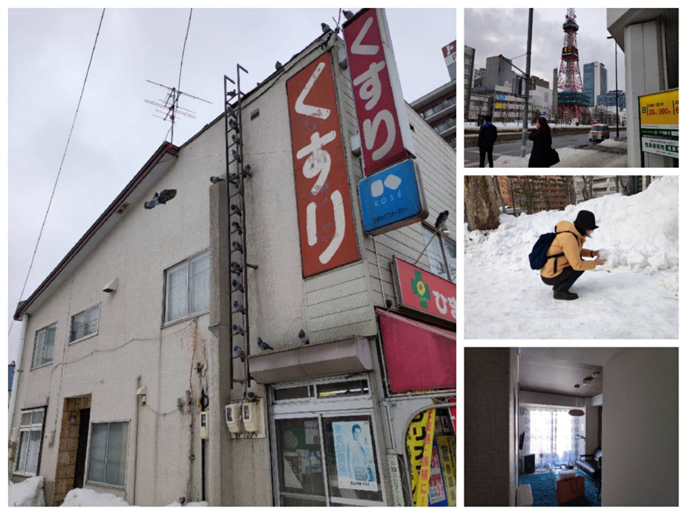
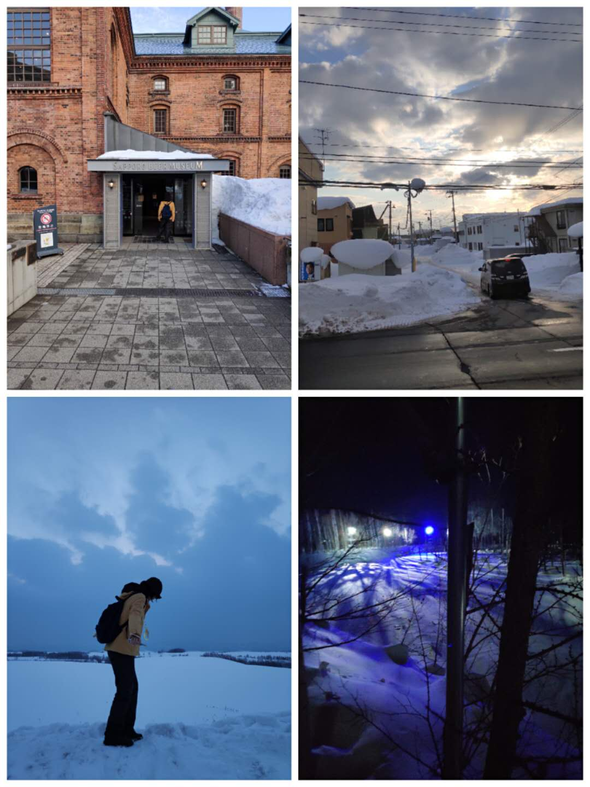
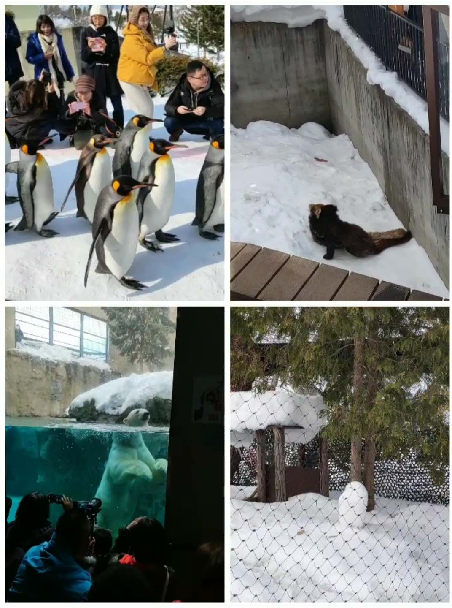

title: "小高小徐阿学阿刁的北海道游记"
date: 2019-06-08 12:05:35 +0000
update: 2019-06-08 12:05:35 +0000
author: xrw
# NOTE: the image locate in `source` folder
# cover: "-/images/posts/example.png"
tags:
    - "旅行"
preview: "TODO: write your blog abstract here"

---

在新年的伊始，我们进行了北海道一周游。此次，我们的脚步👣到达了二世古、小樽、札幌、旭川、美瑛这几个地方。同游者，阿刁，阿学。本次旅行人均花费1.1w RMB左右，不包括购物。

这次旅行是小高和阿学的研究生毕业旅行。同时阿刁也对北海道旅行非常感兴趣，于是我们约定好在小高和阿学毕业答辩结束后，一同前往北海道。在这之前，由于小高是毕业困难户，所以所有的旅游计划基本都是小徐，阿刁和阿学制定的。我们也充分利用了阿刁日语大佬的属性，许多涉及到交涉的问题，都是阿刁完成的。

由于阿刁人在美帝，小高人在山东，因此我们并没有一起前往日本，而是在 2 月 16 日晚上陆续到达北海道新千岁机场。小高和小徐是一起乘坐东方航空的飞机从上海起飞，在日本静冈转机全日空的飞机。由于买票的时候比较匆忙，我们没有发现留给我们的转机时间只有一个半小时。以至于一路上我们都在担心能否赶上飞机。

不过还好，静冈机场非常小，一共只有不到五个登机口，所以换乘还算是方便。这里有一个奇怪的设定，东航换乘全日空的航班，行李是不会自动换航班的，需要到了静冈后先取好再交给全日空柜台重新托运。而在我们回国，全日空换乘东航的航班时，行李是可以由全日空直接转递给东航的。这个可能在选择换乘航班时值得注意。

在飞机上，小徐仍在专心致志地学习英语，是我们学习的榜样。我们啊，还是图。。。扯远了。在飞机上，小高和小徐拍下了一张好看的照片，最后有惊无险，心满意足，心旷神怡地抵达了新千岁机场。

到达机场后，阿学和阿帅已经开始两个人开黑王者荣耀了。与阿刁好久不见，但他也并没有什么变化。随后我们一起前往位于机场附近的酒店，登记入住。当晚，阿学送给了小高两张 Uber 的贴纸，小高开心了好久。

第二天早上，我们在酒店里吃好了早饭，开始前往二世古。二世古是我们的旅行的第一站，也是本次旅行的滑雪担当。我们入住的安努普利二世古酒店，号称ski in，ski out。从酒店后门出去就直接是滑雪场。二世古一带有许多主打滑雪的酒店，之所以选择这家是因为它离初级赛道最近，很适合我们这种青铜玩家。

从新千岁机场到酒店的路很长，坐车也要好几个小时。我们白天从机场附近出发，到酒店时已经是中午了。如果要滑雪的话，可以立刻寄存下行李直接去旁边的滑雪地点。酒店内也可以租雪具、滑雪服等等。不过我觉得自己穿了冲锋衣之类的防水的衣服就没必要再租滑雪服了。但最基本的套装还是需要的，如果需要佩戴眼镜的话，还需要一个额外的护目镜。

之前小徐在上海的银七星滑过，也在国内东北的某滑雪场玩过（具体忘了哪家了），相较而言，二世古的滑雪场的确从各个方面都更胜一筹。

首先，雪的质量，二世古的雪比较松软，俗称粉雪，菜鸡摔了不疼（其实还是疼 T T）。其次，二世古的雪道较长，有较大的发（摔）挥（跤）空间。并且二世谷有各种难度的雪道可供挑选，发（作）挥（死）的空间也非常大。

由于小高是第一次滑雪，虽然小徐尽力教他了，但是还是出师不利，一下滚了十米，对他造成大块心理阴影。不过小徐由于太久没滑，水平也退步很多，也摔了两跤，小高假装没看到。在此小高建议青铜玩家提前买好旅游意外险：）支付宝上就可以操作；同时提醒千万要做好保暖防寒工作。

我们的第二站是小樽。小樽是北海道一个水上交通要塞，比较有名的景点小樽运河沿岸，有许多的曾经的货物仓库。除此之外，八音盒博物馆也是小樽的一个主要景点之一，一共三层，里面摆放了几百种样式的音乐盒。

我们在二世古吃好早饭后，大约 11 点左右到达了小樽的酒店。在办理了行李寄存后，我们一行人吃了午饭，开始了一天的行程。首先我们去了小樽运河，运河的景色确实十分优美。但我们去的时候，雪已经有点脏了，因此建议如果能够在 12 月或者 1 月份来小樽，应该能看到更美的风景。小徐在八音盒博物馆入了一个音乐盒，称之为，贵妇蛋，超级精致有木有：

另外我们一行人还参观了万花筒管，然后人手入了一个迷你便携万花筒，找回了一点童年的乐趣: )夜晚我们沿着著名的小樽运河从景点处走回了酒店。一行人拍了游客照，并且表示晚上的小樽运河和交大闵行校区里面的河看着差不多。

不过，小樽最美的一段风景，应该是在 JR 线从小樽到札幌的路上。车子沿着海边开，路过朝里，风景很美。

离开小樽后，我们前往了本次旅途的最大城市，札幌。札幌的风景真是没什么好说的。不过札幌有不少好吃的。汤咖喱是札幌著名的特色亲民美食。点心类的小吃除了白色恋人之外，还有六花亭。札幌市比较著名的景点包括白色恋人公园、白色恋人工厂、北海道大学、纪念馆。两天时间应该可以逛完，节奏慢一点三天也够了。不过小徐和小高在札幌主要只干了一件事：购物。经过一天的逛吃逛吃，我们发现札幌有许多购物中心，其中许多购物中心退税需要手续费（理论上来讲游客可以退税 8%，但是像大丸百货会收 1.2% 的手续费，实际退税率为 6.8%，在东京购物时并没有碰到这种情况），小徐在北海道常住的同学告诉我们，这种手续费都是百货商店在耍花招坑游客，不知道实际是否可以拒绝支付手续费。

同行的阿刁和阿学则花了一天时间几乎把札幌的所有景点都逛了一遍。

第二天一行人参观了一下啤酒博物馆，在同行的阿刁和阿学的指导下，学习了一下北海道的发展史。这里推荐下啤酒博物馆，还是可以学到一些东西的。

我们在札幌住的是 Airbnb，因此在住宿方面的花费非常少。这多亏了阿刁的预定。接下来，我们下一站是旭川和美英。美英这个地方，实在是没什么好看的，它更像是一个摄像爱好者聚集拍照的地方。这里就不多说了，不是很建议去。

旭川的雪之美术馆，非常不错，值得一去。不过去那里的交通不是非常方便，我们打车过去，在回来的时候完全打不到出租车，最后运气好正好叫到了。雪之美术馆介绍了很多关于雪的学术研究，当然是很久前的。里面有不少视频，和文献资料，可以了解到雪的形成原因等。

最后，我们要强烈推荐旭川动物园。不同于国内的大多数动物园，旭川动物园的特色是，游客可以和小动物距离较近。譬如，除三月份外，每天会有两次企鹅散步，一般在上午11点和下午2点半。小企鹅成群从企鹅馆中走出来沿着固定路线散步，人们夹道欢迎。我们还如愿以偿得看到了北极熊，憨厚可爱。从札幌到旭川有套票，4700日元，里面包含了札幌到旭川来回的巴士车票，旭川站去旭川动物园的来回巴士车票（动物园离市中心有一定距离），旭川动物园的门票，非常划算。要知道，坐jr的话，单程从旭川到札幌就要5000+日元。在此感谢阿学发现了套票，特封为省钱小能手。

最后，我们一起返回了上海，这一段旅途还是非常快乐的，但对于不会滑雪的人来说，确实北海道不是一个非常有吸引力的去处 hh

## 许可协议

- 本文遵守[创作共享CC BY-NC-SA 3.0协议](https://creativecommons.org/licenses/by-nc-sa/3.0/cn/)
- 网络平台转载请联系 <elizax@163.com>
